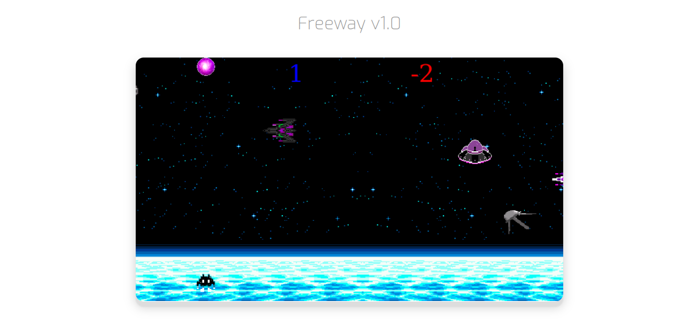

# freeway_v0.1
> Project for a version of the Freeway game. I used the HTML5 <canvas> element and its JavaScript API to manipulate images, control audio streams and render images by capturing the HTML5  element with the getElementById() method and assigning it to a variable, later being manipulated with the ctx.drawImage() method. 
  
  
